# EDA report (updated): SIM interventions, 2020 to 2026-09-24

Team 4, YCIT 440 capstone, Project B (fire-service operations).
Source notebook: [`notebooks/01_eda.ipynb`](../notebooks/01_eda.ipynb). Every EDA number here comes
from [`eda_numbers.json`](eda_numbers.json), which the notebook writes.

**This is the updated copy (2026-10-04).** The original EDA report, as presented, is kept
unchanged in [`eda_report.md`](eda_report.md). This copy replaces its 2024-only baseline preview
with the 2021–2024 rolling-origin results ([`baseline_report.md`](baseline_report.md)) and notes
where the later modelling confirmed or changed an EDA implication
([`final_report.md`](final_report.md)). No EDA measurement has changed.

**Framing (team-accepted v2).** Forecast, one calendar day ahead, the number of SIM interventions
**published in the open data** for each operational Division 1–6. The forecast for day *D* is
prepared on *D−1* using completed daily counts through *D−3*. The baseline is the mean of recent
same-weekday values, with the window chosen on validation data. The primary metric is MAE in
interventions per day, reported with bias. The forecast measures volume, not workload.

**Method.** The notebook follows the ten steps of the course *Dataset Investigation Guide*, then
standard EDA. It recomputes every number stated in the v2 documents (`DEFINITIVE` report, v2
Dataset Investigation Guide, `verification/09_FINAL_VERIFIED.md`) from the local files and stops if
one does not reproduce. **All of them reproduce.** Structure that could influence modelling
(seasonality, autocorrelation, dispersion, baseline windows) is estimated on **2021–2024 only**.
The proposed test period, 2025 onward, is only inspected for level changes.

---

## 1. Key findings

1. **The target can be built, and it is dense.** There are 14,748 division-days. The median is 53
   interventions per day, and no division has a zero day. **2024-12-31 is absent from both files**,
   so it is treated as missing, not as zero. The 600 `DIVISION = 0` rows are undocumented and
   excluded.
2. **The open data are a subset of SIM activity.** Published counts are 93.8%, 94.3% and 93.5% of
   the totals SIM reports for 2022, 2023 and 2024. About 6–7% of each year's incident numbers
   never appear. The target must be called "published interventions".
3. **The level is not stable.** Mean volume went from 227/day (2020, COVID) to 358/day (2025),
   and was flat in 2023–24.
   - **Spring 2020.** First-responder records almost vanish: 56 days between 2020-04-07 and
     2020-07-07 have fewer than 5.
   - **Late 2025.** A drop starts and is concentrated in first-responder calls. For Jan 1 – Sep 24,
     2026 against the same span of 2025:
     - first-responder calls fell 25–30% in Divisions 1–5 and rose 9.5% in Division 6;
     - all other interventions were flat or up (+1% to +16%, except Division 4 at −1.2%).
   - The cause is not documented.
4. **Calendar structure is weak.** The weekday index stays within ±9% of each division's mean.
   STL weekly-seasonal strength is 0.06, against 0.33 for trend. Division 6 (Ville-Marie, Plateau)
   is the exception, with a weekend peak.
5. **The D−3 cutoff removes most short-term persistence.**
   - Lag-1 autocorrelation is 0.36–0.59, but lag 3, the first usable one, is only 0.16–0.38.
   - All divisions are over-dispersed relative to Poisson (variance/mean 2.8–7.0 on 2021–24).
   - ADF rejects a unit root and KPSS rejects a constant level: the series revert to a slowly
     moving level.
6. **Shocks are rare, shared and weather-driven.** A robust detection rule (§5, Step 7) flags 134
   division-days (0.91%). 16 dates are anomalous in at least three divisions at once, led by the
   April 2023 ice storm (1,712 interventions on 2023-04-06). On those days non-medical calls are
   26–73% of the total against 21% overall, and the top types are electrical problems and
   flooding. No calendar feature or count up to D−3 predicts them, and they dominate the MAE
   tail.
7. **The two baselines tie (rolling origin, 2021–2024).**
   - The same-weekday mean over **13 weeks** is the chosen window (MAE **8.48**/day); 4 weeks is
     worst (9.20).
   - The plain 28-day mean ending at D−3 scores **8.49**: a tie. Each wins two divisions and two
     divisions tie.
   - The 2024-only preview in the original report had the plain mean ahead (8.03 against 8.16);
     over four years that advantage disappears.
   - On weekly totals the same-weekday mean wins (35.1 against 37.4 per week).
8. **The typical day is symmetric; the tails are not.** In every division the mean is within
   about 1 of the median, but Division 1's maximum (384) is 13 times its median and its excess
   kurtosis is 245, almost all from the ice storm. Division 6 is the only near-normal division
   (skewness 0.4). Spread is better described by the IQR (10–21) than by the SD (13–18).
9. **Most movement is shared; Division 6 is the exception.** After each division's level is
   removed, 88.5% of month-to-month variation is common to all six divisions, and daily residuals
   of Divisions 1–5 correlate at 0.39–0.64. Division 6 correlates at only 0.14–0.34 and sits 44%
   above the shared pattern in 2026, up from about 10% below it in 2020–21.
10. **CASERNE is not a sub-unit of DIVISION.** 30 of 66 casernes report into more than one of
    Divisions 1–6. Caserne-days are sparse: median 4, and 8.96% are zero. DIVISION is used as
    published and is never rebuilt from casernes.

---

## 2. Dataset Reference and Limitations (draft for the executive report)

> This project uses *Interventions des pompiers de Montréal*, published by the Ville de Montréal
> on its open-data portal (CC BY 4.0, updated daily) and extracted from the SIM's
> computer-assisted dispatch system (RAO). We use the 2020–2024 file and the current two-year file
> (retrieved 2026-09-26). They share one 13-column layout and cover consecutive periods, so they
> are appended, not joined: 754,413 records from 2020-01-01 to 2026-09-24. No external dataset is
> joined.
>
> Each row is one intervention event as published, with its final classification. `INCIDENT_NBR`
> restarts every year; combined with the calendar year it is unique. `CREATION_DATE_TIME` gives
> the event date used to build daily counts. `DIVISION` is the SIM division responsible for the
> territory where the event occurred. It is not the unit that responded, and `CASERNE` does not
> nest inside it. Our target is the daily count of published interventions for each of
> Divisions 1–6. The 600 `DIVISION = 0` records are undocumented and excluded.
>
> Only information available before the forecast is used. A forecast for day *D* is prepared on
> *D−1* from counts through *D−3*, matching the observed two-day publication lag, plus calendar
> variables. The type, territory and deployed vehicles (`NOMBRE_UNITES`) of future events are
> never predictors. Because the portal keeps no historical snapshots, this cutoff is simulated, not
> replayed.
>
> Material quality issues:
>
> - 2024-12-31 is missing from both files and is treated as missing, not zero.
> - 8 records have a date without a time; they are still usable for daily counts.
> - `DESCRIPTION_GROUPE` is blank in 1,788 records and `NOMBRE_UNITES` in 156; 7 records carry the
>   undocumented group `NOUVEAU`.
> - Incident types can be revised after the initial report, and the type vocabulary changes by
>   10–33 types a year.
> - Locations are moved to an intersection of the street segment for privacy.
> - The files hold about 94% of the interventions SIM reports, and the reason is undocumented.
>
> The level shifts twice: first-responder records almost disappear in spring 2020, and fall
> 25–30% from late December 2025 in Divisions 1–5. We therefore use 2020 only as lag history,
> estimate structure on 2021–2024, and evaluate on 2025 onward, reporting error per division and
> by month.
>
> The data do not measure incident duration, response or arrival times, which units responded,
> staffing, crew size, unit availability, costs, or unpublished and unmet demand. The forecasts
> estimate **recorded intervention volume**. They are not estimates of workload, staffing, vehicle
> needs or response-time performance, and we make no claims about those.

---

## 3. Working Dataset Summary (course guide §2)

| Field                            | Interventions des pompiers de Montréal (2020–2024 + current files)                                                                                                                                                                                                                                 |
| -------------------------------- | -------------------------------------------------------------------------------------------------------------------------------------------------------------------------------------------------------------------------------------------------------------------------------------------------- |
| **Dataset and source**           | Ville de Montréal, donnees.montreal.ca, `interventions-service-securite-incendie-montreal`. Files `donneesouvertes-interventions-sim2020.csv` (539,203 rows) and `donneesouvertes-interventions-sim.csv` (215,210 rows). Retrieved 2026-09-26. sha256 recorded in `data/manifest.json`. CC BY 4.0. |
| **Purpose and coverage**         | Extract of SIM's RAO dispatch system, produced for provincial reporting. Covers 2020-01-01 to 2026-09-24 (2-day lag, daily refresh) across the Montréal agglomeration: Montréal plus 14 linked municipalities.                                                                                     |
| **Unit represented by a row**    | One published intervention event with its final classification. There is one vehicle count per event.                                                                                                                                                                                              |
| **Main entities**                | Event; type and group; territorial division (`DIVISION`) and station territory (`CASERNE`); municipality and borough; displaced location. Responding units, crews and times are absent.                                                                                                            |
| **Identifiers and joins**        | Key `(year, INCIDENT_NBR)`: 0 duplicates. The two files are appended: identical header, no date overlap, no key overlap. No external join. CASERNE→DIVISION does not nest: 94.6% of rows fall in the caserne's modal division, and 30 of 66 casernes span several divisions.                       |
| **Relevant variables**           | `CREATION_DATE_TIME` (target date, calendar), `DIVISION` (target grouping). `DESCRIPTION_GROUPE`, `INCIDENT_TYPE_DESC` and `NOMBRE_UNITES` are used for diagnostics only.                                                                                                                          |
| **Privacy transformations**      | Locations moved to an intersection of the street segment: 99% of rows share a coordinate with another row, across 54,308 distinct points. About 6% of dispatch numbers are unpublished. Types may be revised after the initial report.                                                             |
| **Known limitations**            | 2024-12-31 missing. 8 date-only rows. 1,788 blank groups, 156 blank unit counts, 7 `NOUVEAU`. 600 `DIVISION = 0` rows. Type vocabulary churn. First-responder breaks in 2020 and late 2025. No durations, response times, responding units, staffing or costs.                                     |
| **Implications for the project** | Supports daily division-level counts and calendar features. The training window is 2021–2024, with 2020 as lag history. Level drift requires recent-level features and evaluation per division and per month. Does not support workload, staffing, vehicle, coverage or response-time claims.      |

---

## 4. Variable reference (course guide §3)

| Variable                                  | Verified meaning                                                                                          | Type / unit   | Availability and quality                                                                                                       | Project role or limitation                                                          |
| ----------------------------------------- | --------------------------------------------------------------------------------------------------------- | ------------- | ------------------------------------------------------------------------------------------------------------------------------ | ----------------------------------------------------------------------------------- |
| `CREATION_DATE_TIME`                      | Event creation time, local civil time: no records in the skipped spring-forward hour, no midnight heaping | datetime      | Known at call creation; 8 date-only rows (7 in the 2020–24 file, 1 in the current file)                                        | **Builds the target** (date) and calendar features                                  |
| `DIVISION`                                | Division responsible for the event's territory                                                            | int, 0–6      | Complete; `0` = 600 rows, 59–100 per year, undocumented                                                                        | **Target grouping**, Divisions 1–6                                                  |
| `INCIDENT_NBR`                            | Event number; restarts every year                                                                         | int           | Unique with the year; 93–94% of issued numbers published; a second range at 500,000 and above since 2022 (9–109 rows per year) | Key and de-duplication only                                                         |
| `DESCRIPTION_GROUPE`                      | Broad group: 6 official groups plus `NOUVEAU`                                                             | category      | 1,788 blank, mostly fire-type (mean 9.7 vehicles); 7 `NOUVEAU`                                                                 | Drift diagnostics; never a predictor for day *D*                                    |
| `INCIDENT_TYPE_DESC`                      | Detailed type; may be revised after the initial report                                                    | category      | 117–143 types a year, of which 10–33 are new and 11–22 dropped                                                                 | Diagnostics only                                                                    |
| `CASERNE`                                 | Station responsible for the territory, **not** the responder                                              | int           | 1 row = 0; does not nest in DIVISION                                                                                           | Not used: caserne-days are sparse (median 4, 8.96% zero)                            |
| `NOMBRE_UNITES`                           | Vehicles deployed; 1 vehicle ≈ 3–5 firefighters                                                           | int, vehicles | 156 blank; median 1, max 275                                                                                                   | Not a predictor (known only after the event) and not the target (volume ≠ workload) |
| `NOM_VILLE`, `NOM_ARROND`                 | Municipality and borough; `Indéterminé` = linked municipality                                             | text          | Complete                                                                                                                       | Context only                                                                        |
| `LATITUDE`/`LONGITUDE`, `MTM8_X`/`MTM8_Y` | Location displaced to an intersection                                                                     | float         | Complete; inside the agglomeration's bounding box                                                                              | Not used                                                                            |

---

## 5. Findings by investigation step

### Steps 1–2 · Source, version and row unit

| Year | Published | Highest issued number | Share of issued | SIM-reported total | Share of SIM total |
| ---- | --------: | --------------------: | --------------: | -----------------: | -----------------: |
| 2022 |   111,552 |               118,786 |           93.9% |            118,916 |              93.8% |
| 2023 |   121,514 |               128,993 |           94.2% |            128,902 |              94.3% |
| 2024 |   121,432 |               129,523 |           93.8% |            129,822 |              93.5% |
| 2025 |   130,791 |               140,402 |           93.2% |                n/a |                n/a |

The highest issued incident number almost equals SIM's reported total, and about 6% of numbers
never reach the open data. That is why the target says "published".

### Step 3 · Entities: counts and vehicles tell different stories

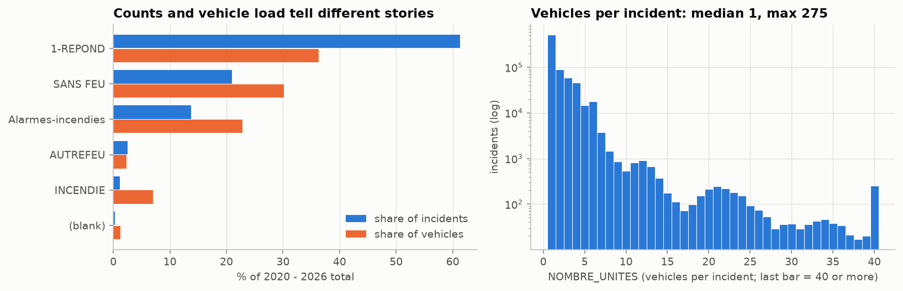

First-responder calls (1-REPOND) are 61% of incidents but only 36% of vehicle deployments. Building
fires are 1% of incidents and 7% of vehicles. Counting incidents is a deliberate choice: it
measures volume, not effort.

### Step 5 · Timing

The last record is 2026-09-24 23:59, retrieved 2026-09-26, a publication lag of **2 days**. That
supports the D−3 cutoff. Timestamps are local civil time. Demand bottoms at 04:00 and stays on a
plateau from 10:00 to 19:00.

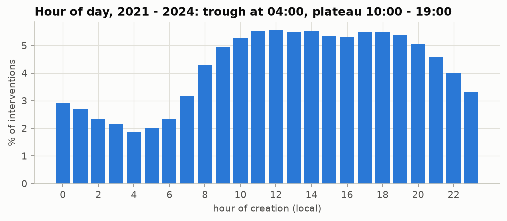

| Variable                                     | Known when                      | Allowed use                |
| -------------------------------------------- | ------------------------------- | -------------------------- |
| Calendar of *D*                              | always                          | predictor                  |
| Daily counts up to *D−3*                     | about 2 days after the day ends | lagged predictor           |
| Type, group, caserne, units of events on *D* | during or after *D*             | never a predictor          |
| Revised type labels                          | unknown delay                   | hindsight labels; not used |

### Step 7 · Missing and non-standard values: planned handling

| Issue                             |  Rows | Pattern                                       | Planned handling                                                                                                                                                                                                  |
| --------------------------------- | ----: | --------------------------------------------- | ----------------------------------------------------------------------------------------------------------------------------------------------------------------------------------------------------------------- |
| 2024-12-31 absent from both files | 1 day | Systematic: gap between the two exports       | Kept as null, never 0. Lag and rolling features that reach back over it stay null (gradient-boosting models take nulls natively; baselines average the values that exist). Forecasts for that day are not scored. |
| `DIVISION = 0`                    |   600 | Spread over all years, undocumented           | Excluded from the target.                                                                                                                                                                                         |
| Blank `DESCRIPTION_GROUPE`        | 1,788 | Systematic: grows over time, mostly fire-type | Not needed for the target. Counted as non-first-responder in any first-responder share feature.                                                                                                                   |
| `NOUVEAU` group                   |     7 | Rare, undocumented                            | Kept in totals; same rule as blanks.                                                                                                                                                                              |
| Date-only timestamps              |     8 | One per day, no pattern                       | Counted on their date.                                                                                                                                                                                            |
| Blank `NOMBRE_UNITES`             |   156 | Rare                                          | No handling: not used.                                                                                                                                                                                            |

### Step 7 · Coverage, level and composition

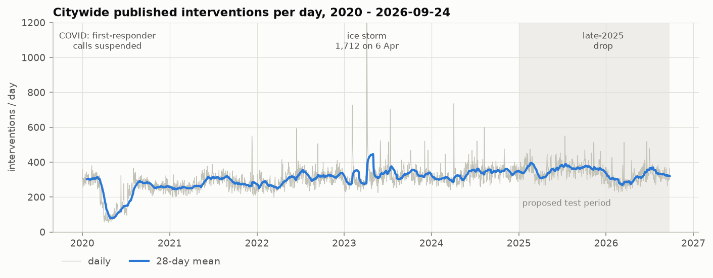

| Year                       |  2020 |  2021 |  2022 |  2023 |  2024 |  2025 | 2026 (to Sep 24) |
| -------------------------- | ----: | ----: | ----: | ----: | ----: | ----: | ---------------: |
| Mean interventions per day | 227.2 | 278.2 | 305.6 | 332.9 | 332.7 | 358.3 |            316.2 |

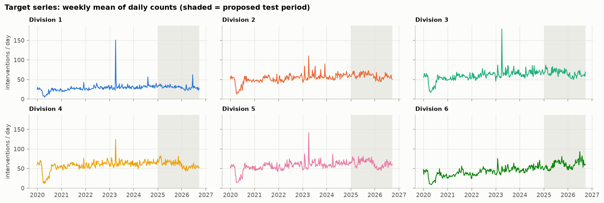

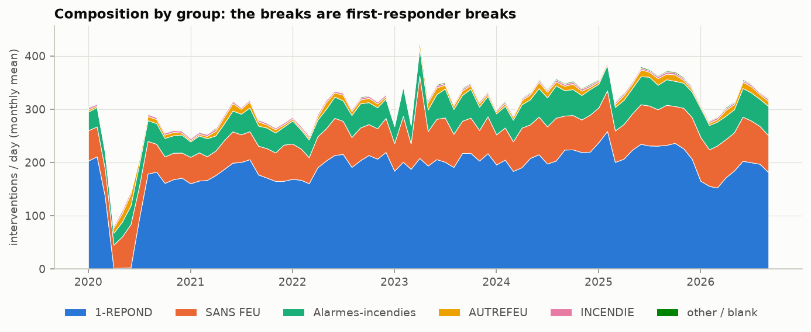

**2026 vs 2025, Jan 1 – Sep 24, % change:**

| Division                   |     1 |     2 |     3 |     4 |     5 |        6 |
| -------------------------- | ----: | ----: | ----: | ----: | ----: | -------: |
| First-responder (1-REPOND) | −27.8 | −28.5 | −24.9 | −29.8 | −27.0 | **+9.5** |
| All other groups           | +16.0 | +12.4 |  +1.0 |  −1.2 |  +2.8 |     +7.6 |

**Density by grain (why DIVISION × day):**

| Grain              |      Cells | Median | Zero cells | Cells ≤ 5 | Variance/mean |
| ------------------ | ---------: | -----: | ---------: | --------: | ------------: |
| Citywide × day     |      2,458 |    307 |         0% |        0% |          18.7 |
| **Division × day** | **14,748** | **53** |     **0%** | **0.14%** |           7.2 |
| Caserne × day      |    162,228 |      4 |      8.96% |    65.04% |           2.8 |

**Target descriptive statistics (interventions per division-day, 2,458 days each):**

| Division | Mean |   SD |  Min |   P5 |   Q1 | Median |   Q3 |  P95 |  Max | Skewness | Excess kurtosis |
| -------- | ---: | ---: | ---: | ---: | ---: | -----: | ---: | ---: | ---: | -------: | --------------: |
| 1        | 28.3 | 13.2 |    2 |   15 |   23 |     28 |   33 |   41 |  384 |    11.02 |           245.1 |
| 2        | 54.2 | 14.6 |    6 |   34 |   47 |     54 |   62 |   74 |  221 |     1.71 |            18.0 |
| 3        | 61.2 | 17.6 |    9 |   37 |   53 |     61 |   69 |   84 |  394 |     4.02 |            62.8 |
| 4        | 59.1 | 15.0 |    5 |   37 |   52 |     59 |   67 |   80 |  287 |     1.24 |            23.7 |
| 5        | 57.8 | 16.3 |    5 |   34 |   49 |     57 |   66 |   81 |  353 |     2.87 |            47.8 |
| 6        | 46.0 | 16.1 |    3 |   22 |   35 |     45 |   56 |   73 |  143 |     0.40 |             1.0 |

Moments use every value, so a few storm days dominate the SD, skewness and kurtosis; quartiles
are not affected. The typical day is symmetric (mean ≈ median), so MAE, which targets the median,
is the right primary metric.

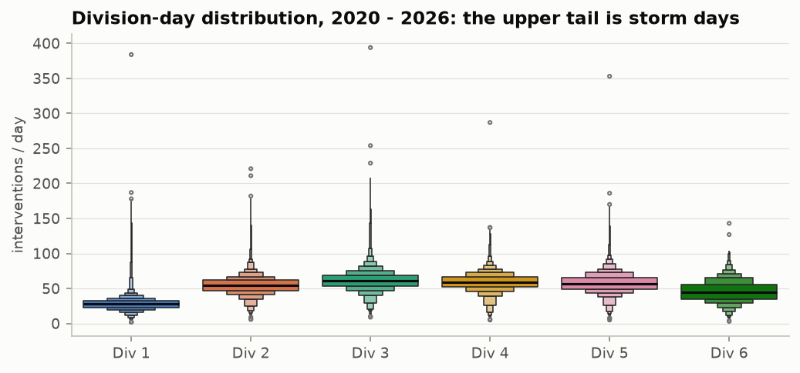

### Step 7 · Seasonality and dynamics (2021–2024)

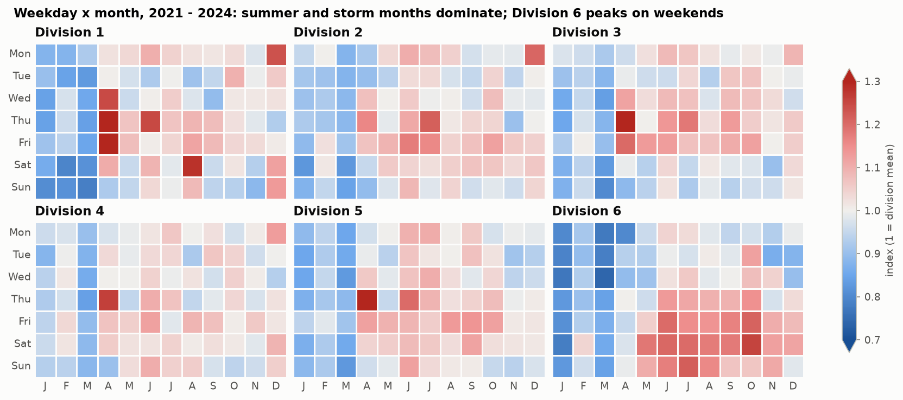

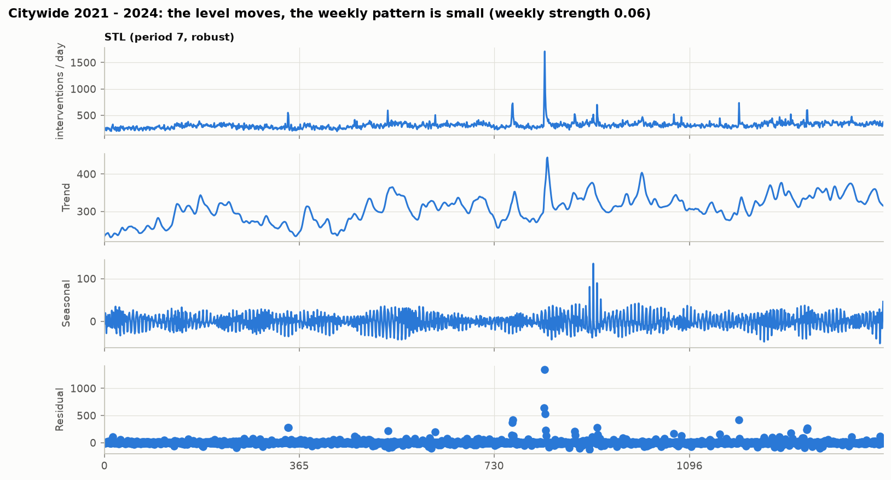

| Division | Mean/day | Variance/mean | ACF lag 1 | ACF lag 3 | ACF lag 7 | ACF lag 28 |
| -------- | -------: | ------------: | --------: | --------: | --------: | ---------: |
| 1        |     29.5 |          7.00 |      0.59 |      0.24 |      0.07 |       0.06 |
| 2        |     55.2 |          3.43 |      0.41 |      0.19 |      0.17 |       0.06 |
| 3        |     62.9 |          4.96 |      0.51 |      0.20 |      0.15 |       0.06 |
| 4        |     61.6 |          2.77 |      0.36 |      0.16 |      0.12 |       0.01 |
| 5        |     58.9 |          4.05 |      0.47 |      0.22 |      0.15 |       0.07 |
| 6        |     43.9 |          3.54 |      0.56 |      0.38 |      0.43 |       0.33 |

For every division, ADF p ≤ 0.0013 and KPSS p ≤ 0.01.

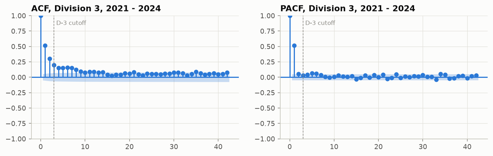

### Step 7 · Anomaly days and shared movement

**Detection.** Ranking days by raw count favours recent years, because the level is higher. Each
division's series is instead decomposed with a robust STL (a LOESS trend of about a month plus a
weekly pattern, with extreme days down-weighted), and the residuals are scaled by their MAD. A
division-day is an anomaly when its robust z-score exceeds 6. That flags about 1% of
division-days by a stated rule. The calendar is saved to `data/processed/anomaly_days.parquet`
for evaluation.

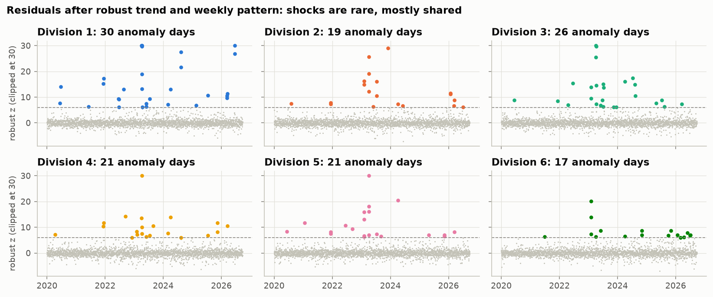

| Division | Anomaly days | Share | Unusually low | Max z |
| -------- | -----------: | ----: | ------------: | ----: |
| 1        |           30 | 1.22% |             0 |  88.8 |
| 2        |           19 | 0.77% |             3 |  29.1 |
| 3        |           26 | 1.06% |             0 |  53.4 |
| 4        |           21 | 0.85% |             1 |  37.3 |
| 5        |           21 | 0.85% |             0 |  46.9 |
| 6        |           17 | 0.69% |             3 |  20.0 |

**Days anomalous in at least three divisions:**

| Date             | Divisions | Citywide interventions | Non-medical share | Top type              |
| ---------------- | --------: | ---------------------: | ----------------: | --------------------- |
| 2023-04-06 (Thu) |         6 |                  1,712 |             72.6% | Problèmes électriques |
| 2024-04-04 (Thu) |         6 |                    736 |             53.8% | Problèmes électriques |
| 2021-12-11 (Sat) |         5 |                    550 |             54.0% | Premier répondant     |
| 2023-02-04 (Sat) |         5 |                    697 |             41.9% | Premier répondant     |
| 2023-02-05 (Sun) |         5 |                    728 |             49.0% | Inondation            |
| 2023-04-05 (Wed) |         5 |                    950 |             64.8% | Problèmes électriques |
| 2023-04-07 (Fri) |         5 |                    930 |             52.5% | Premier répondant     |
| 2023-07-13 (Thu) |         5 |                    701 |             50.9% | Premier répondant     |
| 2026-03-17 (Tue) |         5 |                    513 |             47.3% | Premier répondant     |
| 2021-12-12 (Sun) |         4 |                    499 |             52.7% | Premier répondant     |
| 2023-04-08 (Sat) |         4 |                    639 |             41.0% | Premier répondant     |
| 2023-06-01 (Thu) |         4 |                    524 |             26.2% | Premier répondant     |
| 2020-06-11 (Thu) |         3 |                    324 |             69.8% | Problèmes électriques |
| 2022-06-16 (Thu) |         3 |                    593 |             42.7% | Premier répondant     |
| 2024-08-10 (Sat) |         3 |                    600 |             45.5% | Premier répondant     |
| 2025-07-13 (Sun) |         3 |                    550 |             35.9% | Premier répondant     |

The April 2023 ice storm is confirmed; the other dates match weather patterns (electrical
problems, flooding) but have not been checked against weather records. Detection on residuals
also finds shocks a top-N list misses, such as 2020-06-11: an ordinary-looking 324
interventions, but 70% non-medical during the COVID low.

**Shared vs division-specific movement.** Daily residuals of Divisions 1–5 correlate at
0.39–0.64; Division 6 at 0.14–0.34. A Tukey median polish of the division × month table (log
scale, so effects are percentages) separates the shared month effects from division-specific
residuals:

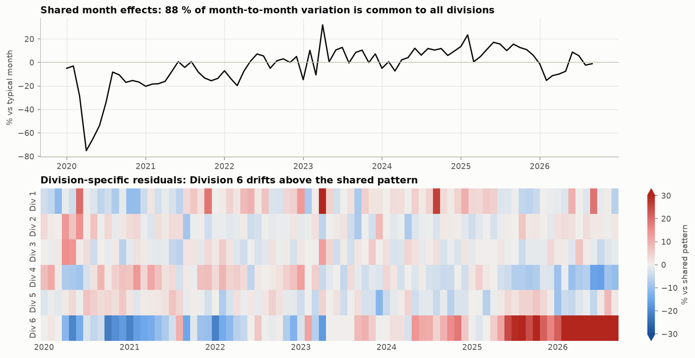

- **88.5%** of month-to-month variation is common to all divisions: COVID (−75% in April 2020),
  the ice storm (+32% in April 2023).
- The late-2025 first-responder drop hit five of six divisions, so it counts as shared movement.
  Division 6, which did not drop, sits **44% above** the shared pattern in 2026, up from about
  10% below it in 2020–21. Divisions 1–5 stay within 10% of it.

### Steps 8–9 · Privacy and what the data do not measure

Locations are snapped to intersections: 99% of rows share a coordinate. About 6% of dispatch
numbers are unpublished. Labels may be revised. There is no personal data.

The data do not include response or arrival times, durations, responding units, crew size,
staffing, unit availability, costs, call priority, outcomes, or unmet demand.

### Step 10 · Fitness: baselines by rolling origin, 2021–2024

MAE in interventions per day, 8,760 division-days per model. Every forecast uses only data at or
before *D−3*; models are refitted monthly. Source:
[`baseline_validation.json`](baseline_validation.json).

| Division                | Same weekday, 13 wk | Plain 28-day mean |
| ----------------------- | ------------------: | ----------------: |
| 1                       |            **6.32** |              6.37 |
| 2                       |                8.77 |          **8.74** |
| 3                       |            **9.71** |              9.86 |
| 4                       |                8.84 |          **8.73** |
| 5                       |                9.36 |              9.35 |
| 6                       |                7.88 |              7.89 |
| **All**                 |            **8.48** |              8.49 |
| Bias, all               |               −0.48 |             −0.16 |
| All, anomaly days out   |                7.72 |              7.72 |

Same-weekday windows of 4, 8, 13, 26 and 52 weeks score 9.20, 8.64, 8.48, 8.51 and 8.57 overall,
so 13 weeks is chosen. The original report's 2024-only preview (plain 28-day 8.03, 13 and 26
weeks 8.16) is kept in [`eda_report.md`](eda_report.md).

---

## 6. Implications for modelling

- **Split.**
  - 2020 serves as lag history only (COVID).
  - Fit and select on 2021–2024 with rolling-origin (expanding-window) validation. Plain k-fold
    cross-validation would train on days after the ones it scores, leaking future levels and
    storms into every fold.
  - Test on 2025-01-01 → 2026-09-24. The late-2025 break falls inside the test period, which makes
    it a real drift test.
- **Baseline.** Keep the v2 same-weekday baseline, with the window chosen on validation data:
  13 weeks (MAE 8.48 on 2021–2024). Also report the **plain 28-day mean** as the secondary
  reference recommended in `09_FINAL_VERIFIED.md` §7; over 2021–2024 it ties (8.49), so a model
  has to beat both.
- **Features.**
  - Recent levels (rolling means ending at D−3) and calendar features: weekday, month, holidays.
  - Drop the linear time trend; the red-team review showed it over-predicts after Dec 2025.
  - Add a first-responder share feature to track composition drift (built from past calls up to
    D−3 only).
- **Target scale and loss.** Counts are over-dispersed and right-skewed. Fit on the raw count
  with a Poisson or Tweedie objective (negative-binomial for a GLM), or on `log1p` and transform
  back; compare both on validation MAE, always scored on the original scale. Use quantile
  intervals rather than Poisson ones.
- **Model structure.** One pooled model across divisions with a division effect: most movement is
  shared. Division 6 needs its own recent-level features, or it will be under-forecast.
- **Evaluation.** Report MAE and bias per division and by month, with and without the anomaly
  days in `data/processed/anomaly_days.parquet`. Anomaly days are not predictable from the
  calendar or from counts up to D−3; use a robust loss or flag them rather than dropping them
  silently from training.
- **Open questions for the team.**
  - What changed in first-responder dispatch in late 2025?
  - What is `DIVISION = 0`?
  - Should public weather forecasts be added? Surges are weather-driven, but the v2 design
    excludes external data.

### How the implications held up

From [`final_report.md`](final_report.md):

- **The room above the baselines was small, as the weak persistence at D−3 suggested.** The
  noise floor was estimated at about 7.3–7.5 ([`baseline_report.md`](baseline_report.md)). The
  final model, the mean of five forecasters, scored MAE 8.00 on the 2025-01-01 → 2026-09-24 test period against 8.79 for
  the same-weekday baseline (9% lower, 95% CI 0.50 to 1.08) and 8.20 for the plain 28-day mean
  (not significantly different overall).
- **The late-2025 break was a real drift test.** Models with recent-level features followed the
  drop; the 13-week same-weekday mean kept forecasting the old level (bias +1.0 after
  2025-12-20) and fell behind.
- **Division 6 was the risk the EDA flagged.** It is the one division the final model
  under-forecasts after the break (bias −0.96), though with lower MAE than either baseline.
- **Anomaly days stayed unpredictable**: they carry the largest errors for every model.
- **Raw-count tree models without a level offset could not follow level shifts**: the best single
  model in validation was the worst of the five on the test.

## 7. Differences from the v2 documents

No v2 number is contradicted. These results are new or sharper:

- **The plain 28-day mean is as strong as the chosen same-weekday baseline** (8.49 against 8.48
  over 2021–2024). On 2024 alone it was ahead (8.03 against 8.16), but that does not generalise.
  The red team found that a simple model beats the plain mean by only about 1% on the test
  period, with a confidence interval including zero; our final model beats it by 2.5% on the test,
  also with an interval including zero.
- **Division 6 behaves differently.** First-responder calls rose while Divisions 1–5 fell, it has
  the only strong weekend peak, persistent autocorrelation at lag 28, the weakest share of common
  shocks, and it sits 44% above the shared pattern in 2026.
- **Anomaly days come from a stated rule**, robust STL residuals with z > 6, rather than from a
  top-N list of raw counts.
- **COVID gap as defined here:** 56 days with fewer than 5 first-responder records between
  2020-04-07 and 2020-07-07. The red team gives 31 Mar – 8 Jul under a different definition.
- **Share of SIM-reported totals** (93.5–94.3%) is now computed from the files rather than quoted.

## Reproduce

```bash
uv sync --locked
uv run python -m ycit440_sim_forecast.manifest verify   # same input bytes
uv run --with nbconvert jupyter nbconvert --to notebook --execute notebooks/01_eda.ipynb --output-dir /tmp
uv run python -m ycit440_sim_forecast.evaluate baselines   # the 2021–2024 baseline numbers
```
